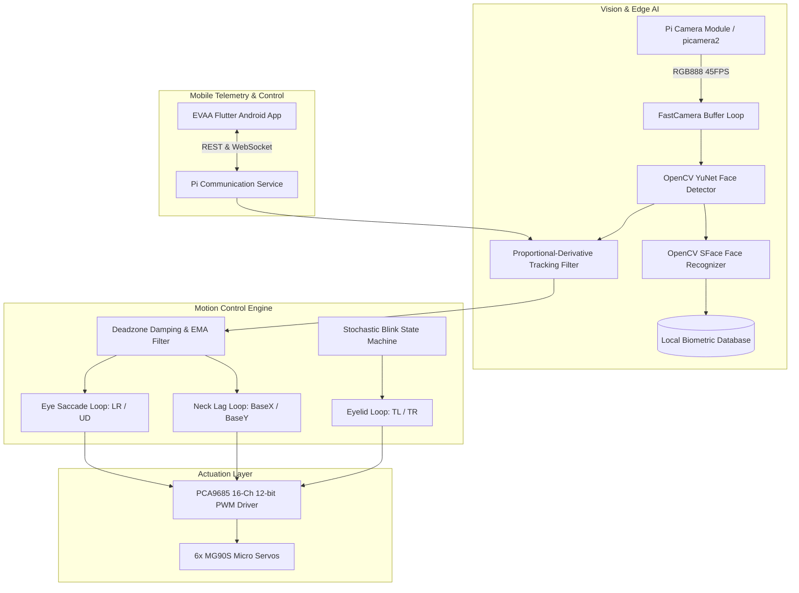

# EVAA: Bio-Mimetic Autonomous Humanoid Vision & Face-Tracking Companion

<div align="center">

[](https://www.raspberrypi.com/)
[-blue.svg?logo=opencv)](https://opencv.org/)
[](app-release.apk)
[](#hardware-architecture--wiring-schematic)
[%20Ready-orange.svg)](#sih-evaluator-summary)
[](LICENSE)

*An edge-AI powered bio-mimetic humanoid vision head featuring dual-tier gaze coordination, synchronized eyelid kinematics, biometric facial recognition, and cross-platform mobile tele-operation.*

[Overview](#project-overview) • [Architecture](#system-architecture) • [Hardware & Wiring](#hardware-architecture--wiring-schematic) • [Mobile Companion App](#evaa-mobile-companion-app) • [Installation](#setup--installation-guide) • [Calibration](#calibration--testing-suite) • [SIH Highlights](#sih-evaluator-summary)

---

</div>

## 📌 Project Overview

**EVAA** (*Enhanced Vision & Autonomous Assistant*) is an intelligent, low-cost bio-mimetic robotic vision system engineered for natural human-robot interaction (HRI). Designed to operate entirely on edge hardware (Raspberry Pi), EVAA bridges the gap between static surveillance systems and responsive social robotics.

### Core Problem & Innovation
Conventional robotic vision systems are either prohibitively expensive or suffer from rigid, robotic motions that trigger the *uncanny valley* effect. EVAA resolves this by combining:
1. **Dual-Tier Decoupled Kinematics**: Low-latency eye saccades (micro-servos, low inertia) decoupled from smooth, filtered neck panning and tilting (base servos, high inertia), faithfully replicating human gaze mechanics.
2. **Realistic Bio-Mimicry & Natural Blinking**: A non-linear stochastic blink state machine controlling independent upper eyelids with randomized intervals (5–30s) and rapid micro-motion phases (55ms close, 25ms hold, 75ms open).
3. **Edge Deep Learning**: Fully local ONNX inference utilizing OpenCV's lightweight **YuNet** for ultra-fast face detection (45+ FPS) and **SFace** for 128-dimensional biometric facial embedding and identity verification.
4. **Zero-Cloud Latency & Complete Privacy**: All camera frames and facial embeddings are processed and stored locally on the Raspberry Pi without any cloud dependencies.
5. **Cross-Platform Tele-Operation**: Includes a compiled native Android Companion App (`app-release.apk`) and complete Flutter source code (`EVA-APK-source/`) for real-time telemetry, remote manual control, and mode switching.

---

## 🏗️ System Architecture



---

## ⚡ Hardware Architecture & Wiring Schematic

EVAA runs on a **Raspberry Pi 4 / 5** paired with a **PCA9685 16-Channel 12-bit PWM I2C Controller** operating at **50Hz**.

### 1. Servo Channel Mapping (6-DOF)
| Channel | Identifier | Function / Motion Axis | Typical Range | Center |
| :---: | :---: | :--- | :---: | :---: |
| **CH0** | `LR` | Eye Horizontal Pan (Left / Right) | 60° – 120° | 90° |
| **CH1** | `UD` | Eye Vertical Tilt (Up / Down) | 60° – 120° | 90° |
| **CH2** | `TL` | Top-Left Eyelid (Blink / Expression) | 90° (Open) – 160° (Closed) | 90° |
| **CH3** | `BaseX` | Neck / Head Yaw (Base Left / Right) | 30° – 150° | 90° |
| **CH4** | `TR` | Top-Right Eyelid (Blink / Expression) | 90° (Open) – 20° (Closed) | 90° |
| **CH5** | `BaseY` | Neck / Head Pitch (Base Up / Down) | 40° – 170° | 90° |

### 2. I2C Pinout Connections
| Raspberry Pi Physical Pin | Raspberry Pi GPIO | PCA9685 Pin | Description |
| :--- | :--- | :--- | :--- |
| **Pin 1** | 3.3V Power | `VCC` | Logic power (3.3V logic) |
| **Pin 3** | GPIO 2 (SDA) | `SDA` | I2C Data line |
| **Pin 5** | GPIO 3 (SCL) | `SCL` | I2C Clock line |
| **Pin 6 / 9 / 14** | Ground | `GND` | Common ground reference |

> [!WARNING]
> **Power Rail Safety Notice**: Never power the 6 MG90S servos from the Raspberry Pi's 5V pin! Stalling servos draw up to 2.5A peak and cause voltage brownouts that will corrupt the Pi SD card. Always connect an **external regulated 5V–6V 3A+ power supply** to the PCA9685 `V+` screw terminal and tie its ground to the Raspberry Pi GND.

---

## 📱 EVAA Mobile Companion App

The repository includes a ready-to-install Android release package: **[`app-release.apk`](app-release.apk)** (49.6 MB), alongside full multi-platform Flutter source code in [`EVA-APK-source/`](EVA-APK-source/).

### Key Mobile Capabilities
- **Hospitality Mode (`🏨`)**: Configures EVAA for greeting visitors, continuous polite gaze orientation, and natural engagement.
- **Cognitive / Play Mode (`🎮`)**: Activates interactive tracking routines and reactive eyelid gestures.
- **Real-Time Telemetry**: Live indicators for battery levels, system temperature, CPU utilization, camera status, and I2C link health.
- **Remote Tele-Operation**: Manual joystick and directional overrides for remote surveillance or inspection.
- **Offline Mock Service**: Built-in demonstration simulator for showcasing the UI without physical robot hardware.

### Sideloading the APK on Android
1. Download **[`app-release.apk`](app-release.apk)** directly to your Android device (or via USB / Google Drive).
2. Open your device's **Files / Downloads** app and tap `app-release.apk`.
3. If prompted, enable **"Allow from this source"** in *Install Unknown Apps* settings.
4. Launch **EVA** from your app drawer.

---

## 🧠 Pretrained Edge AI Models

EVAA leverages lightweight, state-of-the-art ONNX models bundled in the [`models/`](models/) directory:
- **`models/face_detection_yunet_2023mar.onnx`** (232 KB): Real-time face detection model designed specifically for edge devices, yielding bounding boxes, confidence scores, and 5 facial landmarks (eyes, nose, mouth corners).
- **`models/face_recognition_sface_2021dec.onnx`** (38.7 MB): Deep facial feature extractor that generates a 128-dimensional embedding vector per face for accurate cosine-distance matching.

Models can also be fetched anytime via:
```bash
bash scripts/download_models.sh
```

---

## 📂 Repository Directory Structure

```text
EVAA/
├── app-release.apk                 # Ready-to-install Android companion app (Flutter build)
├── EVA-APK-source/                 # Complete cross-platform Flutter source code
│   ├── lib/
│   │   ├── app/                    # UI screens (Dashboard, Theme, Routing)
│   │   ├── communication/          # WebSocket & REST client services for Pi
│   │   └── core/                   # Telemetry models, enums (Hospitality / Cognitive)
│   └── pubspec.yaml                # Flutter project specifications & dependencies
├── models/
│   ├── face_detection_yunet_*.onnx # Edge face detector (232 KB)
│   └── face_recognition_sface_*.onnx # Edge biometric feature extractor (38.7 MB)
├── scripts/
│   ├── camera_test.py              # Camera feed & orientation verification
│   ├── check_system.py             # System diagnostic check (OpenCV, picamera2, DNN)
│   ├── download_models.sh          # Model auto-downloader utility
│   ├── enroll_face.py              # Interactive 8-sample face biometric registration
│   ├── face_detect.py              # Visual face detection debug preview
│   └── face_recognition.py         # Live face recognition against registered database
├── camera.py                       # High-speed multi-threaded camera pipeline (Picamera2)
├── face_tracker.py                 # Core autonomous face tracking & bio-mimetic coordinator
├── servo_controller.py             # I2C PCA9685 servo driver with rate-limiting & fail-safe
├── rc_controller.py                # Direct PWM controller variant
├── servo_calibration.py            # Interactive terminal-based axis calibration tool
├── manual_servo_control.py         # WASD / keyboard manual tele-operation utility
├── servo_test.py                   # Initial safety sweep test for all servo channels
├── servo_motion_test.py            # Dynamic multi-axis motion verification
├── lr_test.py / ud_test.py         # Eye axis isolated diagnostic scripts
├── tl_test.py / tr_test.py         # Eyelid isolated diagnostic scripts
├── base_x_test.py / base_y_test.py # Neck yaw/pitch isolated diagnostic scripts
├── install_pi.sh                   # Raspberry Pi automated dependency installer
├── requirements.txt                # Python package requirements
├── .gitignore                      # Git exclusion rules
├── LICENSE                         # MIT Open Source License
└── README.md                       # Comprehensive project documentation
```

---

## 🚀 Setup & Installation Guide

### Prerequisites
- **Hardware**: Raspberry Pi 4 Model B (4GB/8GB) or Raspberry Pi 5 with Raspberry Pi Camera Module (v2 / v3 / HQ)
- **Operating System**: Raspberry Pi OS 64-bit (Debian Bookworm or Bullseye)
- **Actuation**: PCA9685 I2C Module + 6x MG90S Micro Servos + 5V 3A+ Power Supply

### Step 1: Enable Hardware Interfaces on Raspberry Pi
```bash
sudo raspi-config
```
- Navigate to **Interface Options** -> Enable **I2C**.
- Navigate to **Interface Options** -> Enable **Camera**.
- Reboot your Raspberry Pi: `sudo reboot`.

### Step 2: Clone the Repository & Install Dependencies
```bash
git clone https://github.com/salkeomkar578-lab/EVAA...git
cd EVAA..
```

Install core dependencies via the included automated installer:
```bash
bash install_pi.sh
```

Or install manually via `requirements.txt`:
```bash
pip install -r requirements.txt --break-system-packages
```

### Step 3: Run Pre-Flight Diagnostics
Verify camera and OpenCV DNN modules:
```bash
python3 scripts/check_system.py
```
*Expected Output:*
```text
OpenCV: 4.8.x
FaceDetectorYN: True
FaceRecognizerSF: True
Picamera2: OK
```

Verify camera preview and proper orientation:
```bash
python3 scripts/camera_test.py
```
*(Press `q` to exit preview)*

---

## ⚙️ Calibration & Testing Suite

### 1. Servo Zeroing & Connection Check
> [!IMPORTANT]
> **Safety First**: Disconnect all mechanical horns and linkages before running this test to prevent physical binding if a servo was assembled off-center.

```bash
python3 servo_test.py
```
This moves each channel sequentially through `90° -> 80° -> 90° -> 100° -> 90°` and resets all to center.

### 2. Multi-Axis Motion Test
Once linkages are attached, run the automated sweep:
```bash
python3 servo_motion_test.py
```

### 3. Interactive Axis Calibration
Fine-tune individual center offsets and mechanical limit bounds:
```bash
python3 servo_calibration.py
```
*(Saves calibrated angle offsets into `servo_calibration.json`)*

### 4. Manual Keyboard Tele-Operation
Test real-time control via terminal keyboard input:
```bash
python3 manual_servo_control.py
```
| Key | Axis | Movement |
| :---: | :---: | :--- |
| `W` / `S` | Base Pitch (`BaseY`) | Head Up / Down |
| `A` / `D` | Base Yaw (`BaseX`) | Head Left / Right |
| `I` / `K` | Eye Vertical (`UD`) | Look Up / Down |
| `J` / `L` | Eye Horizontal (`LR`) | Look Left / Right |
| `Y` / `H` | Left Eyelid (`TL`) | Open / Close |
| `U` / `O` | Right Eyelid (`TR`) | Open / Close |

---

## 🎯 Running Autonomous Tracking & Recognition

### 1. Register User Biometrics (Optional)
To enable EVAA to identify you by name:
```bash
python3 scripts/enroll_face.py --name "Omkar"
```
Position your face within the bounding frame. The system will capture 8 distinct facial feature samples and save them locally in `data/faces.json`.

### 2. Launch Autonomous Follower Bot
```bash
python3 face_tracker.py
```
EVAA will immediately begin autonomous operation:
- Detects the primary human face in the camera frame.
- Calculates pixel displacement relative to frame center (`(320, 240)`).
- Applies deadzone thresholds and kinematic rate scaling.
- Directly positions eye servos for immediate gaze acquisition.
- Smoothly rotates neck servos to center the subject in the workspace.
- Randomly triggers natural eyelid blinks during tracking.
- Press `Q` to cleanly park servos at center and exit.

---

## 🏆 SIH Evaluator Summary

| Evaluation Criteria | EVAA Implementation Highlights |
| :--- | :--- |
| **Technical Novelty** | Dual-tier decoupled bio-mimetic kinematics (saccadic eyes + smooth inertial neck) with non-linear stochastic blinking. |
| **Edge Feasibility** | Runs entirely on an embedded Raspberry Pi 4/5 at 45 FPS using OpenCV YuNet DNN. Zero expensive cloud GPU dependency. |
| **Data Privacy & Security** | Biometric embeddings are generated and stored locally in encrypted JSON formats. No external video streaming to third parties. |
| **Cost Efficiency** | Complete hardware bill of materials (BOM) is under **₹6,500 (~$80 USD)**, compared to commercial robotic heads costing $2,000+. |
| **User Experience & Telemetry** | Includes a ready-to-deploy **Flutter Android Companion App** with real-time system monitoring, Hospitality mode, and manual override. |
| **Extensibility** | Modular software architecture allows straightforward drop-in integration of LLM voice agents, ROS2 nodes, or edge object detectors. |

---

## 👥 Contributors & Acknowledgements

- **Omkar Salke** - System Architecture, Computer Vision Pipeline & Embedded Integration ([@salkeomkar578-lab](https://github.com/salkeomkar578-lab))
- Developed for **Smart India Hackathon (SIH)** and open-source robotics research.

## 📄 License

This project is licensed under the [MIT License](LICENSE) - see the LICENSE file for details.
