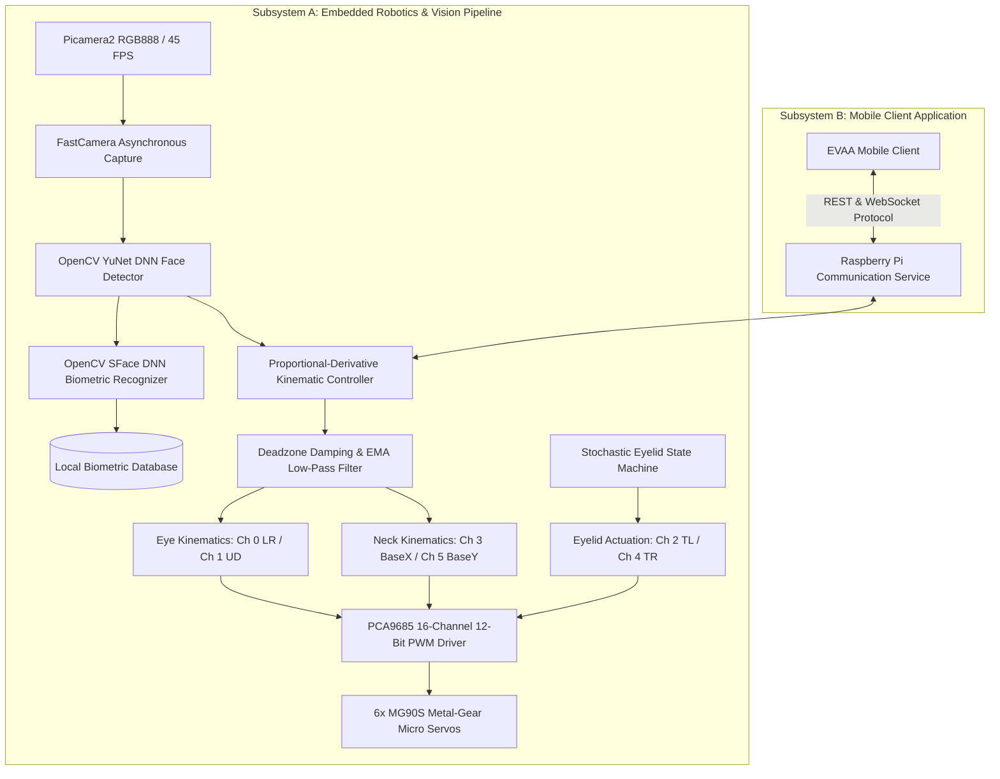

# EVAA..: Low-Cost Plug-and-Play Modular Service Robot for Smart Hospitality, Retail & Financial Services. 

[](https://www.raspberrypi.com/)
[](https://opencv.org/)
[](EVA-APK-source/)
[-green.svg?logo=android&logoColor=white)](https://github.com/salkeomkar578-lab/EVAA../raw/main/app-release.apk)
[-black.svg)](#hardware-specifications-and-wiring)
[](LICENSE)

An embedded edge-AI robotic vision head featuring dual-tier gaze coordination, synchronized eyelid kinematics, biometric identity verification, and cross-platform mobile tele-operation.

---

### Direct Application Download
The compiled companion application for Android is available for direct installation:
- **Download Link**: [Download EVAA Android App (app-release.apk)](https://github.com/salkeomkar578-lab/EVAA../raw/main/app-release.apk)
- **Package Name**: `com.example.eva`
- **Target Platform**: Android 7.0 (Nougat) and higher (ARM64-v8a, ARMv7a, x86_64)
- **Binary Size**: 47.36 MB (49,660,942 bytes)
- **Source Directory**: [`EVA-APK-source/`](EVA-APK-source/)

---

## Table of Contents
1. [System Architecture Overview](#system-architecture-overview)
2. [Subsystem Classification](#subsystem-classification)
   - [Subsystem A: Embedded Vision and Robotics Firmware](#subsystem-a-embedded-vision-and-robotics-firmware-python)
   - [Subsystem B: Mobile Telemetry and Tele-Operation Client](#subsystem-b-mobile-telemetry-and-tele-operation-client-flutter)
3. [Hardware Specifications and Wiring](#hardware-specifications-and-wiring)
4. [Computer Vision and Pretrained Weights](#computer-vision-and-pretrained-weights)
5. [Embedded Setup and Deployment Guide](#embedded-setup-and-deployment-guide)
6. [Calibration and Diagnostic Verification](#calibration-and-diagnostic-verification)
7. [License and Team](#license-and-team)

---

## System Architecture Overview

The EVAA platform is partitioned into two synchronized subsystems:
1. **Embedded Robotics Firmware**: Runs on the Raspberry Pi host, performing real-time video capture, neural face detection, dual-tier gaze tracking, eyelid blink state simulation, and PWM servo modulation.
2. **Mobile Telemetry Client**: Operates on Android devices, communicating with the robotic platform via REST endpoints and bidirectional WebSockets for manual overrides, mode selection, and diagnostics.



---

## Subsystem Classification

The repository enforces strict architectural separation between the embedded Python firmware and the Flutter mobile client codebase:

### Subsystem A: Embedded Vision and Robotics Firmware (Python)
Located at repository root and within `scripts/` and `models/`:

| Module / Path | Technical Role | Description |
| :--- | :--- | :--- |
| [`camera.py`](camera.py) | Vision Acquisition | High-throughput threaded capture using `picamera2` and `libcamera`. Streams 640x480 frames at 45 FPS with hardware orientation transforms (`hflip=1`, `vflip=1`). |
| [`face_tracker.py`](face_tracker.py) | Motion Coordinator | Primary runtime engine. Integrates YuNet face detection with dual-tier gaze/neck decoupling, deadband damping, exponential moving average filters, and randomized eyelid blink intervals. |
| [`servo_controller.py`](servo_controller.py) | Actuation Driver | Direct I2C interface to the PCA9685 driver. Implements duty-cycle conversion, minimum write intervals, and error retry logic. |
| [`rc_controller.py`](rc_controller.py) | Direct PWM Driver | Low-overhead PWM register writer for direct register-level angle dispatch. |
| [`servo_calibration.py`](servo_calibration.py) | Axis Calibration | Curses-based terminal interface for interactive trim tuning, center alignment, and software angle boundary storage (`servo_calibration.json`). |
| [`manual_servo_control.py`](manual_servo_control.py) | Terminal Tele-Operation | Low-latency keyboard controller mapping WASD and IJKL keys to individual axes for physical verification. |
| [`servo_test.py`](servo_test.py) | Safety Sweep Test | Automated sequential sweep (`90° -> 80° -> 90° -> 100° -> 90°`) across all 6 channels to safely center servos before horn installation. |
| [`servo_motion_test.py`](servo_motion_test.py) | Dynamic Range Test | Multi-axis kinematic range verification across mechanical design limits. |
| `base_x_test.py`, `base_y_test.py` | Axis Diagnostics | Isolated motion verification for base pan (yaw) and base tilt (pitch). |
| `lr_test.py`, `ud_test.py` | Eye Axis Diagnostics | Isolated motion verification for eye horizontal pan and eye vertical tilt. |
| `tl_test.py`, `tr_test.py` | Eyelid Diagnostics | Isolated actuation verification for left and right eyelid linkages. |
| [`scripts/check_system.py`](scripts/check_system.py) | Environment Check | Validates presence of OpenCV DNN modules (`FaceDetectorYN`, `FaceRecognizerSF`) and Picamera2 hardware interfaces. |
| [`scripts/camera_test.py`](scripts/camera_test.py) | Sensor Verification | Displays live windowed stream to verify focus, illumination, and color balance. |
| [`scripts/face_detect.py`](scripts/face_detect.py) | Detection Debugger | Diagnostic visualization displaying face bounding boxes, confidence values, and centroid coordinates. |
| [`scripts/enroll_face.py`](scripts/enroll_face.py) | Biometric Enrollment | Captures 8 facial samples of a user, crops and aligns faces, extracts 128-D SFace feature vectors, and persists embeddings to local storage. |
| [`scripts/face_recognition.py`](scripts/face_recognition.py) | Biometric Identifier | Real-time facial identification matching detected faces against registered embeddings using cosine similarity. |
| [`scripts/download_models.sh`](scripts/download_models.sh) | Weight Provisioner | Shell script to fetch official OpenCV Zoo ONNX model binaries. |

### Subsystem B: Mobile Telemetry and Tele-Operation Client (Flutter)
Located in [`EVA-APK-source/`](EVA-APK-source/) with compiled artifact [`app-release.apk`](app-release.apk):

| Component / Path | Technical Role | Description |
| :--- | :--- | :--- |
| [`app-release.apk`](app-release.apk) | Binary Release | Compiled Android APK ready for immediate deployment on evaluation hardware. |
| [`EVA-APK-source/lib/main.dart`](EVA-APK-source/lib/main.dart) | Application Entry | Flutter application initialization and entry loop. |
| [`EVA-APK-source/lib/app/eva_dashboard_page.dart`](EVA-APK-source/lib/app/eva_dashboard_page.dart) | UI Dashboard | Central tele-operation cockpit presenting status indicators, telemetry feeds, and mode controls. |
| [`EVA-APK-source/lib/app/theme.dart`](EVA-APK-source/lib/app/theme.dart) | Design System | High-contrast dark-mode interface system designed for field operation. |
| [`EVA-APK-source/lib/communication/raspberry_pi_service.dart`](EVA-APK-source/lib/communication/raspberry_pi_service.dart) | Transport Layer | Client implementation for REST endpoint `/robot/status` and bidirectional WebSocket channel `/ws/eva`. |
| [`EVA-APK-source/lib/communication/mock_eva_service.dart`](EVA-APK-source/lib/communication/mock_eva_service.dart) | Test Fixture | Offline simulator service enabling UI evaluation and telemetry demo without a physical robot connected. |
| [`EVA-APK-source/lib/core/enums/eva_mode.dart`](EVA-APK-source/lib/core/enums/eva_mode.dart) | Operation Modes | State declarations for `Hospitality` (visitor greeting/social gaze) and `Cognitive` (interactive tracking). |
| [`EVA-APK-source/lib/core/models/eva_models.dart`](EVA-APK-source/lib/core/models/eva_models.dart) | Data Models | Serializers for telemetry data: CPU utilization, core temperature, link status, and subsystem health flags. |

---

## Hardware Specifications and Wiring

The robotic platform utilizes a **Raspberry Pi 4 Model B (or Raspberry Pi 5)** running 64-bit OS, interfaced to a **PCA9685 16-Channel 12-Bit PWM driver** over the I2C bus at address `0x40`.

### 1. Actuator Configuration (6 Degrees of Freedom)
| Channel | Signal Name | Kinematic Function | Motion Limits | Neutral Position |
| :---: | :---: | :--- | :---: | :---: |
| **0** | `LR` | Eye Horizontal Saccade (Pan) | 60.0° – 120.0° | 90.0° |
| **1** | `UD` | Eye Vertical Saccade (Tilt) | 60.0° – 120.0° | 90.0° |
| **2** | `TL` | Top-Left Eyelid (Blink / Gesture) | 90.0° (Open) – 160.0° (Closed) | 90.0° |
| **3** | `BaseX` | Head Pan / Neck Yaw | 30.0° – 150.0° | 90.0° |
| **4** | `TR` | Top-Right Eyelid (Blink / Gesture) | 90.0° (Open) – 20.0° (Closed) | 90.0° |
| **5** | `BaseY` | Head Tilt / Neck Pitch | 40.0° – 170.0° | 90.0° |

### 2. Physical Interconnect Wiring Table
| Raspberry Pi Physical Pin | Signal / Function | PCA9685 Terminal | Wiring Specification |
| :--- | :--- | :--- | :--- |
| **Pin 1** | +3.3V Logic | `VCC` | Logic supply (Raspberry Pi 3.3V) |
| **Pin 3** | GPIO 2 (SDA) | `SDA` | I2C Data bus |
| **Pin 5** | GPIO 3 (SCL) | `SCL` | I2C Clock bus |
| **Pin 6 / 9 / 14** | Ground | `GND` | Shared reference ground |
| **External Supply (+)** | Regulated +5.0V to +6.0V | `V+` (Screw Terminal) | Dedicated servo power rail (>= 3.0A) |
| **External Supply (-)** | Power Ground | `GND` (Screw Terminal) | Common ground with Raspberry Pi |

> **Electrical Notice**: Do not supply servo power (`V+`) from the Raspberry Pi 5V power pins. Six micro-servos under peak transient acceleration can draw up to 2.8A, creating voltage dips that cause system brownouts and filesystem corruption on the single-board computer. Always use an isolated regulated 5V/3A+ buck converter for the actuator rail with a common ground reference.

---

## Computer Vision and Pretrained Weights

The vision pipeline uses lightweight Open Neural Network Exchange (ONNX) models loaded into OpenCV's deep neural network (DNN) module:

1. **Face Detector**: `models/face_detection_yunet_2023mar.onnx` (232 KB)
   - **Input Dimensions**: Configured for 640x480 resolution.
   - **Output Format**: Detection confidence score, bounding rectangle `(x, y, w, h)`, and five facial landmarks (right eye, left eye, nose tip, right mouth corner, left mouth corner).
   - **Inference Speed**: ~22ms per frame on Raspberry Pi 4 CPU (~45 FPS).
2. **Face Feature Extractor**: `models/face_recognition_sface_2021dec.onnx` (38.7 MB)
   - **Input Dimensions**: Aligned and cropped 112x112 face patches.
   - **Output Format**: 128-dimensional L2-normalized feature embedding vector.
   - **Matching Metric**: Cosine similarity threshold >= 0.363 for positive verification.

Model weights are version-controlled inside the repository and can also be re-downloaded via:
```bash
bash scripts/download_models.sh
```

---

## Embedded Setup and Deployment Guide

### Prerequisites
- Raspberry Pi 4 Model B or Raspberry Pi 5
- Raspberry Pi Camera Module (v2, v3, or HQ)
- 64-bit Raspberry Pi OS (Debian Bookworm or Bullseye)
- Python 3.9 or higher

### Step 1: Interface Configuration
Enable I2C and Camera hardware peripherals:
```bash
sudo raspi-config
```
Navigate to **Interface Options** -> enable **I2C** and **Camera**, then reboot:
```bash
sudo reboot
```

### Step 2: Repository Installation
Clone the repository:
```bash
git clone https://github.com/salkeomkar578-lab/EVAA...git
cd EVAA..
```

Install the required Python runtime packages:
```bash
bash install_pi.sh
```
Or via pip:
```bash
pip install -r requirements.txt --break-system-packages
```

### Step 3: Hardware Interface Self-Test
Verify that the camera and deep neural network drivers load correctly:
```bash
python3 scripts/check_system.py
```
*Expected Output:*
```text
OpenCV: 4.8.x
FaceDetectorYN: True
FaceRecognizerSF: True
Picamera2: OK
```

Verify camera sensor orientation:
```bash
python3 scripts/camera_test.py
```
*(Press `q` to exit preview)*

---

## Calibration and Diagnostic Verification

### 1. Actuator Neutral Alignment
Before mounting physical mechanical horns to the servo splines, verify channel signaling:
```bash
python3 servo_test.py
```
This routine cycles each channel through test angles and centers all splines at exactly 90.0°.

### 2. Dynamic Motion Sweep
Once linkages are assembled, run the coordinated motion test:
```bash
python3 servo_motion_test.py
```

### 3. Interactive Mechanical Calibration
Adjust hardware offset trims and physical stop limits:
```bash
python3 servo_calibration.py
```
The resulting offsets are persisted to `servo_calibration.json` to prevent mechanical binding.

### 4. Direct Manual Tele-Operation
To test manual actuator response via keyboard:
```bash
python3 manual_servo_control.py
```
Control mappings:
- `W` / `S`: Head Tilt (BaseY) Up / Down
- `A` / `D`: Head Pan (BaseX) Left / Right
- `I` / `K`: Eye Tilt (UD) Up / Down
- `J` / `L`: Eye Pan (LR) Left / Right
- `Y` / `H`: Left Eyelid (TL) Open / Close
- `U` / `O`: Right Eyelid (TR) Open / Close

### 5. Biometric Profile Registration
To register a new user for recognized tracking:
```bash
python3 scripts/enroll_face.py --name "User"
```
The script captures 8 face samples across varied angles and updates the local embedding store at `data/faces.json`.

### 6. Production Autonomous Tracking
To start the autonomous tracking system:
```bash
python3 face_tracker.py
```
The robot will acquire detected faces, calculate pixel offset errors from image center (320, 240), steer eye servos for rapid target capture, smoothly interpolate neck servos to center the target in frame, and periodically actuate natural eyelid blinks. Press `Q` to safely park servos and terminate.

---


---

## License and Team

- **Lead Developer**: Omkar Salke ([@salkeomkar578-lab](https://github.com/salkeomkar578-lab))
- **Project Initiative**: Smart India Hackathon (SIH) & Open Humanoid Robotics Research
- **License**: MIT License (see [LICENSE](LICENSE) for terms)
